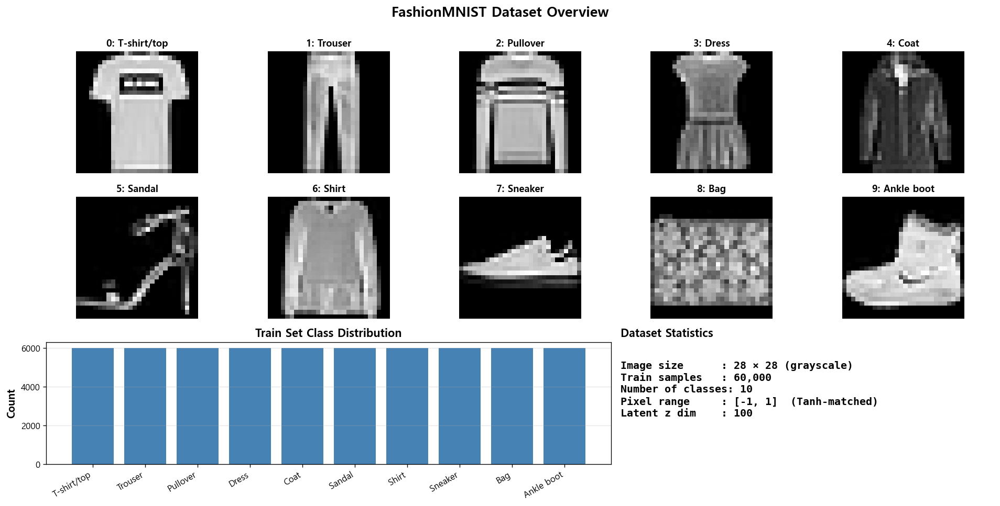
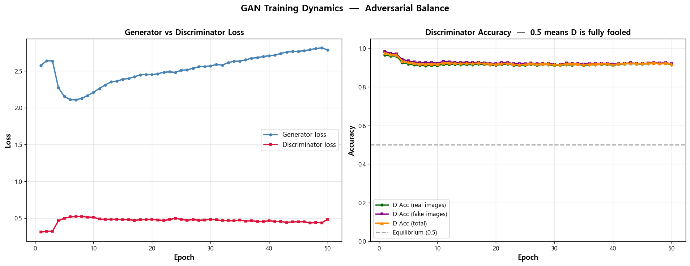
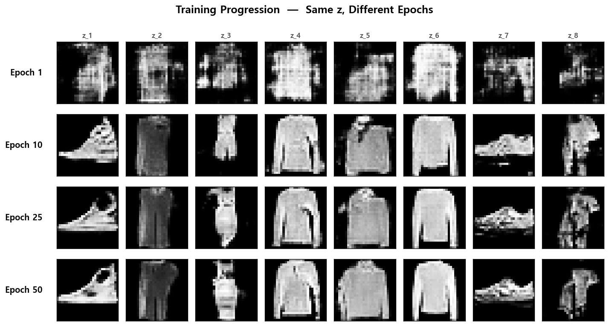
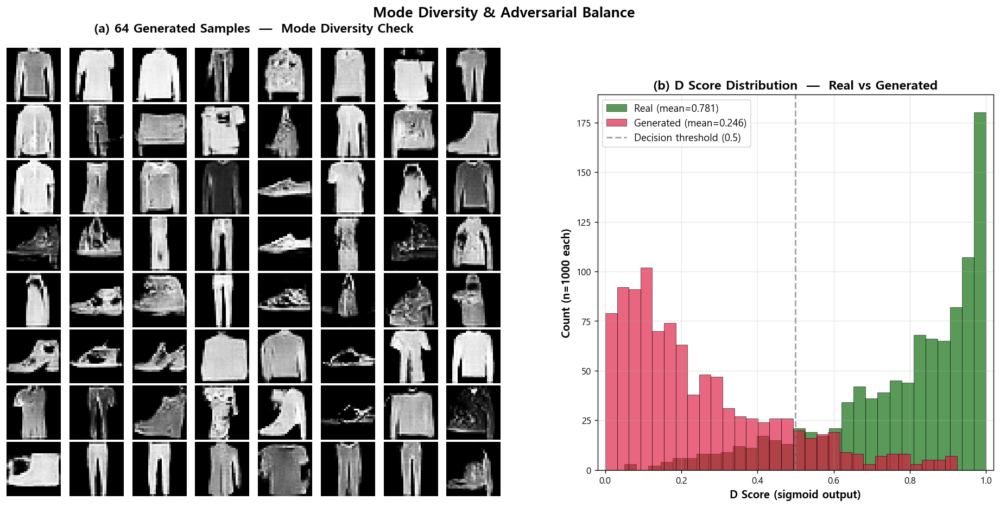
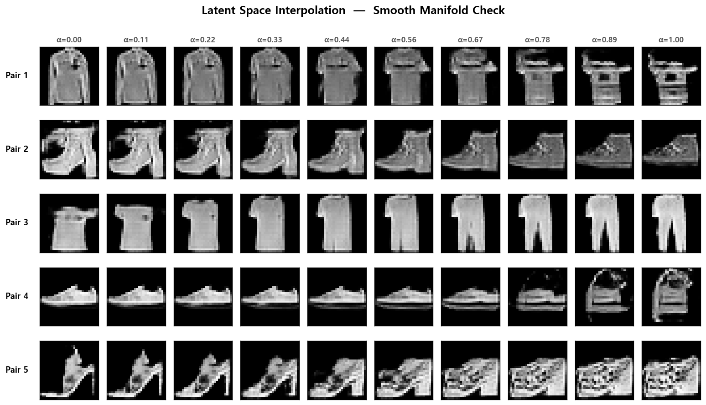
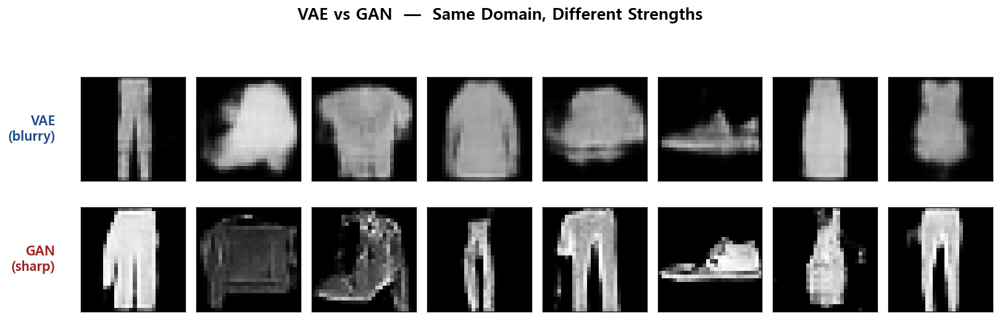

# 🎭 GAN from Scratch — A Deep Convolutional GAN for Image Generation in PyTorch
### FashionMNIST 28×28 이미지를 적대적 학습(Generator vs Discriminator)으로 생성하는, PyTorch로 직접 구현한 DCGAN.


---

## 📌 프로젝트 요약 (Project Summary)

GAN(Generative Adversarial Network)의 가장 대표적 변형인 **DCGAN(Deep Convolutional GAN)** 을 PyTorch로 구현해본 프로젝트입니다. VAE처럼 손실 함수 한 줄(ELBO)로 깔끔하게 떨어지는 모델과 달리, GAN은 **Generator와 Discriminator가 서로 속고 속이는 적대적 학습**을 통해 이미지를 만들어 갑니다. 이번 프로젝트의 핵심은 그 minimax 학습 구조를 코드로 직접 짜보면서 "왜 G와 D를 따로 학습해야 하는가", "왜 GAN의 학습은 본질적으로 불안정한가" 같은 질문들을 코드 레벨에서 익히는 것이 1차 목표였습니다.

데이터셋은 **FashionMNIST**(28×28 grayscale, 60k)이며, **이전 프로젝트인 [vae-from-scratch](https://github.com/AD-Styles/vae-from-scratch)와 동일한 데이터셋을 의도적으로 재사용**해서 두 모델을 직접 비교할 수 있게 했습니다. 학습 후에는 G/D 손실 곡선, D Accuracy의 균형 변화, 학습 진행에 따른 생성 결과 변화, 64개 샘플 다양성(Mode Collapse 체크), D Score 분포 분석, latent 공간 보간, 그리고 **VAE vs GAN 동일 조건 비교**까지 6개의 시각화로 정리했습니다.

---

## 📂 프로젝트 구조 (Project Structure)

```
gan-from-scratch/
├── results/
│   ├── 01_dataset_overview.png            # FashionMNIST 10개 클래스 + 분포 + 통계
│   ├── 02_training_curve.png              # G/D Loss + D Accuracy (Equilibrium 0.5 비교)
│   ├── 03_training_progression.png        # 같은 z, 다른 epoch — 학습 진행 추적
│   ├── 04_diversity_and_d_score.png       # 64개 샘플 다양성 + D Score 분포 (real vs fake)
│   ├── 05_latent_walk.png                 # z-space 보간 5쌍 (manifold 부드러움)
│   └── 06_vae_vs_gan_comparison.png       # 이전 프로젝트 vae-from-scratch와 동일 조건 직접 비교 (blurry vs sharp)
├── src/
│   └── main.py                            # DCGAN 모델 + 학습 루프 + 시각화 통합 스크립트
├── .gitignore
├── LICENSE
├── README.md
└── requirements.txt
```

---

## 🧩 핵심 개념 (Key Concepts)

| 개념 | 한 줄 설명 |
|------|-----------|
| **적대적 학습 (Adversarial Training)** | G와 D가 서로 속고 속이는 minimax 게임 — GAN의 핵심 아이디어 |
| **생성자 (Generator, G)** | random noise z를 입력받아 그럴듯한 이미지를 생성 |
| **판별자 (Discriminator, D)** | 입력 이미지가 진짜(1)인지 가짜(0)인지 판별 |
| **DCGAN (Deep Convolutional GAN)** | FC layer 제거, Conv/ConvT + BatchNorm으로 안정화한 GAN |
| **BCE Loss** | Binary Cross-Entropy — D의 real/fake 분류와 G의 D 속이기에 모두 사용 |
| **Non-saturating G Loss** | G가 `D(G(z))→1`을 목표로 학습 (saturating loss의 vanishing gradient 회피) |
| **DCGAN 안정화 트릭 (Stabilization Tricks)** | G hidden에 BatchNorm + 출력에 Tanh, D hidden에 LeakyReLU(0.2) — 한쪽으로 학습이 폭주하는 것을 방지 |
| **Mode Collapse** | G가 특정 카테고리만 반복 생성하는 GAN의 대표적 실패 모드 |
| **Equilibrium (D Acc = 0.5)** | 이론적 균형점 — D가 진짜/가짜를 구별 못 함. **실제로는 도달하기 매우 어려움** |

---

## 🏗️ 모델 구조 (Model Architecture)

```
입력: z ~ N(0, I)   (100-dim random noise)
   ↓
┌───────────────────────────────────────────────┐
│  Generator (CNN)                              │
│   ├ FC(100 → 7×7×128) → BatchNorm → ReLU      │
│   ├ Reshape (128, 7, 7)                       │
│   ├ ConvT 128 → 64, stride 2 (7×7 → 14×14)    │
│   │     → BatchNorm → ReLU                    │
│   └ ConvT 64 → 1, stride 2 (14×14 → 28×28)    │
│       → Tanh   (output range [-1, 1])         │
└───────────────────────────────────────────────┘
   ↓
   G(z): 28×28 fake image
   ↓
┌───────────────────────────────────────────────┐
│  Discriminator (CNN)                          │
│   ├ Conv 1 → 64, stride 2 (28×28 → 14×14)     │
│   │     → LeakyReLU(0.2)                      │
│   ├ Conv 64 → 128, stride 2 (14×14 → 7×7)     │
│   │     → BatchNorm → LeakyReLU(0.2)          │
│   └ Flatten → FC(128×7×7 → 1)                 │
│       → (Sigmoid는 BCEWithLogitsLoss에서)     │
└───────────────────────────────────────────────┘
   ↓
   D(x): real(1) / fake(0) probability
```

| Component | 차원 / 설정 |
|-----------|------------|
| Latent z dim | 100 |
| G hidden channels | (128, 64) |
| D hidden channels | (64, 128) |
| G activation | ReLU (hidden) / Tanh (output) |
| D activation | LeakyReLU 0.2 (hidden) / Sigmoid (output, BCE에서 적용) |
| Image pixel range | [-1, 1] (Tanh-matched 정규화) |
| Loss | BCEWithLogitsLoss (real=1, fake=0) |
| Optimizer | Adam (lr=2e-4, β1=0.5, β2=0.999) — DCGAN 논문 표준 |
| **Generator params** | **0.78 M** |
| **Discriminator params** | **0.14 M** |
| **Total params** | **0.92 M** |

---

## 📊 학습 결과 (Training Results)

학습은 RTX 4060에서 **50 epochs (약 11분 37초)** 로 진행했습니다. G와 D의 적대적 줄다리기가 어떻게 균형을 잡아가는지 5개 지표(G/D loss, D Acc 3종)로 모두 기록했습니다.

| Epoch | G_loss | D_loss | D Acc (real) | D Acc (fake) | D Acc (total) | 비고 |
|-------|--------|--------|--------------|--------------|---------------|------|
| 1   | 2.57 | 0.31 | 0.965 | 0.985 | 0.975 | 초반 — D가 압도 |
| 5   | 2.15 | 0.50 | 0.919 | 0.935 | 0.927 | G가 따라잡기 시작 |
| 10  | 2.21 | 0.51 | 0.911 | 0.923 | 0.917 | snapshot |
| 25  | 2.51 | 0.48 | 0.912 | 0.921 | 0.917 | snapshot, 절반 |
| **50** | **2.79** | **0.48** | **0.916** | **0.920** | **0.918** | **최종 — D Acc ≈ 0.92 plateau** |

**핵심 관찰 (Key Observations)**

- **G Loss는 V자 곡선** — epoch 1~3에서 2.57→2.64로 잠시 정체했다가, epoch 4~7에서 2.27→2.11로 급감, 그 후 점진적으로 상승해 epoch 50에서 2.79. **G가 D를 따라잡았다가 D가 다시 G를 학습해서 따라가는 적대적 줄다리기의 직접적 흔적**
- **D Acc는 0.92 부근에서 plateau** — 이론적 균형점(0.5)에 수렴하지 않음. 이는 표준 DCGAN의 본질적 특성으로, **D는 사람 눈에 안 보이는 미세 픽셀 차이까지 잡아내기 때문**에 충분히 그럴듯한 이미지여도 여전히 구분 가능 (자세한 분석은 시각화 04번 참고)
- **Mode Collapse 발생하지 않음** — 64개 샘플에서 상의/하의/신발/가방 등 다양한 카테고리가 골고루 나옴 (시각화 04번에서 확인)

---

## 🔍 시각화 결과 분석 (Visualization Analysis)

### 1. Dataset Overview (데이터셋 개요)



FashionMNIST는 10개 의류 클래스 × 6,000장씩으로 균등하게 구성된 60,000장 학습셋입니다. **GAN에서는 데이터를 [-1, 1] 범위로 정규화하는 것이 중요**한데, 이는 Generator의 마지막 Tanh activation의 출력 범위와 맞추기 위함입니다 (VAE는 Sigmoid라 [0, 1] 그대로 사용).

이전 프로젝트인 [vae-from-scratch](https://github.com/AD-Styles/vae-from-scratch)와 정확히 같은 데이터셋을 의도적으로 재사용했습니다. 이렇게 하면 **모델 자체의 차이(VAE vs GAN)만이 결과 차이를 만드는 유일한 변수**가 되어, 시각화 06번에서 두 모델을 공정하게 비교할 수 있습니다.

<br>

### 2. Training Dynamics — G vs D Loss & D Accuracy (학습 동학 — G/D 손실과 D 정확도)



GAN의 가장 흥미로운 부분이자 가장 어려운 부분이 한눈에 보이는 그림입니다.

- **(좌) G/D Loss** — G Loss는 epoch 4~7에서 2.27→2.11로 급감했다가 그 후 점진적으로 2.79까지 상승. D Loss는 epoch 1=0.31에서 시작해 epoch 5에서 0.50까지 급상승한 뒤 0.48 부근에서 안정. **초반 D Loss의 급상승은 G가 학습되면서 D가 점점 헷갈리기 시작했다는 신호**입니다. 초반(1~7)에는 두 곡선이 반대 방향으로 움직이고, 후반(7~50)에는 G Loss가 점진 상승하면서 D Loss는 plateau에 머무는 게 적대적 학습의 직접적 시각화입니다. VAE의 ELBO처럼 단조감소하는 깔끔한 곡선과 정반대
- **(우) D Accuracy + Equilibrium Line** — D Acc가 학습 초반 0.97에서 시작해 0.92 부근에서 plateau에 안착. **이론적 균형점(0.5, 회색 점선)에 수렴하지 않음**. 처음엔 이게 학습이 잘못된 줄 알았는데, 시각화 04번을 그려보고 표준 GAN의 자연스러운 특성이라는 걸 이해함

<br>

### 3. Training Progression — Same z, Different Epochs (학습 진행 — 같은 z, 다른 epoch)



**고정된 z 8개**를 학습 epoch 1, 10, 25, 50 시점에 각각 디코딩한 결과입니다. z가 같으니 epoch별 차이는 오직 G의 학습 정도 때문.

- **Epoch 1** — 거의 노이즈에 가까운 형체. G가 아직 어떤 의미적 구조도 못 잡음
- **Epoch 10** — 이미 신발, 긴소매 상의, 짧은 셔츠 등 **알아볼 수 있는 형태로 수렴**. 9 epoch 만에 큰 도약. 표준 DCGAN의 가장 인상적인 부분
- **Epoch 25 → 50** — 형태는 거의 유지되지만 디테일(굽 모양, 옷 라인, 그림자)이 점진적으로 선명해짐

→ **각 z가 어떤 카테고리로 수렴하는지가 학습 초기에 결정되고, 후반은 디테일 향상**이라는 흥미로운 패턴이 보입니다. VAE에서는 잘 보이지 않는 현상 (VAE는 KL 항이 z를 정규분포에 묶어두기 때문에 z가 특정 카테고리를 강하게 capture하는 정도가 약함).

<br>

### 4. Mode Diversity & D Score Distribution (모드 다양성 + D Score 분포)



**이번 포트폴리오에서 가장 분석 깊이가 깊은 시각화**입니다. GAN의 두 가지 핵심 우려(Mode Collapse와 D의 균형)를 한 그림으로 검증합니다.

**(a) 64 Generated Samples — Mode Diversity Check**
- 상의(셔츠, 풀오버, 코트), 하의(바지), 신발(부츠, 운동화, 샌들), 가방 등 **모든 주요 카테고리가 골고루 등장**
- 일부 노이즈가 섞인 샘플(특히 모서리)은 있지만, 대다수가 인식 가능한 형태
- **Mode Collapse는 발생하지 않음** — PDF p.53에서 강조한 GAN의 대표적 실패 모드를 피한 결과

**(b) D Score Distribution — Real vs Generated**
- **Real images: mean D Score = 0.781** (대부분 0.7~1.0 범위에 분포)
- **Generated images: mean D Score = 0.246** (대부분 0~0.4 범위에 분포)
- 두 분포가 0.5 threshold를 기준으로 **명확하게 분리**됨

→ **이 그림이 D Acc 0.92 plateau의 원인을 정확히 설명합니다**. D는 사람 눈에는 안 보이는 픽셀 단위의 미세한 차이(예: 가짜 이미지에 일관되게 존재하는 약간의 노이즈 패턴, 엣지의 부드러움 차이)를 잡아내기 때문에 (a)의 결과가 시각적으로 충분히 그럴듯해도 여전히 잘 구분합니다. **GAN 평가에 D Acc 대신 FID, IS 같은 별도 metric이 필요한 이유**가 코드 레벨에서 확인되는 결과입니다.

<br>

### 5. Latent Space Interpolation (잠재 공간 보간)



서로 다른 5쌍의 random z를 10단계로 선형 보간해서 디코딩한 결과입니다. **G가 학습한 z-space manifold가 부드러운지** 검증합니다.

- **Pair 1**: 긴소매 상의 → 짧은 셔츠 형태로 변환 (다만 α=1.0 근처에서 디테일이 다소 무너짐 — 보간 끝단의 한계)
- **Pair 2**: 부츠 → 운동화/스니커즈 (같은 신발 카테고리 내 부드러운 변환)
- **Pair 3**: **T-shirt → 바지** — **카테고리가 완전히 다른 두 객체 사이에서도 manifold가 부드럽게 이어지는 게 가장 인상적**
- **Pair 4**: 운동화의 디테일이 점진적으로 변하는 미세 변환
- **Pair 5**: 굽 있는 신발의 형태가 점진적으로 변형되지만 α=1.0 쪽에서 노이즈가 끼는 게 보임 — GAN 보간의 한계가 드러나는 부분

→ 만약 GAN이 mode collapse에 빠졌거나 z-space가 학습이 잘 안 됐다면 보간 중간이 노이즈로 무너졌을 텐데, 모든 단계가 인식 가능한 형태로 이어집니다. **GAN의 잠재 공간이 단순한 noise-to-image mapping이 아니라 의미 있는 manifold**라는 직접 증거입니다.

<br>

### 6. VAE vs GAN — Same Domain, Different Strengths (VAE vs GAN — 같은 도메인, 다른 강점)



**이번 포트폴리오의 가장 강력한 차별 포인트**입니다. **같은 FashionMNIST 데이터셋**으로 학습한 이전 프로젝트 [vae-from-scratch](https://github.com/AD-Styles/vae-from-scratch)의 VAE와 이 프로젝트의 GAN을, 각자의 prior `N(0, I)`에서 독립적으로 8개씩 샘플링해 한 그림에서 직접 비교했습니다 (같은 z를 공유하는 게 아니라, 두 모델 각각의 분포에서 자유롭게 샘플링한 결과).

- **(위) VAE (blurry)** — 형태(silhouette)는 보존되지만 픽셀 디테일이 평균화되어 흐릿함. BCE 손실이 모든 비슷한 이미지의 픽셀 평균을 향해 수렴하는 본질적 결과 (PDF p.21)
- **(아래) GAN (sharp)** — 부츠의 굽 라인, 가방의 모서리, 바지의 봉제선 같은 high-frequency 디테일이 명확하게 살아남음. Discriminator가 픽셀 단위 디테일까지 평가하기 때문에 G가 어쩔 수 없이 sharp한 결과를 생성

> ⚠️ 참고: 위 8개씩은 각 모델 prior에서 **독립적으로 샘플링**한 결과라, GAN 쪽에 바지가 우연히 여러 개 나옴. **다양성 자체는 시각화 04번 (64개 샘플)에서 별도로 검증**됨.

→ "왜 GAN이 더 선명한가"라는 질문에 대한 **가장 직관적인 답**: VAE는 분포를 직접 모델링하니까 평균화되고, GAN은 D가 픽셀 차이를 잡아내니까 선명도가 살아남습니다. PDF p.21과 p.53의 차이를 한 그림으로 검증한 결과입니다.

---

## 💡 회고록 (Retrospective)

직전 프로젝트인 vae-from-scratch를 마치고 GAN으로 넘어오면서 가장 먼저 느낀 건 손실 함수의 구조 자체가 완전히 다르다는 점이었습니다. VAE는 ELBO라는 단일 손실을 단조감소시키면 끝이었는데, GAN은 G와 D를 따로 학습시켜야 했고, 두 모델이 동시에 좋아지는 게 아니라 한쪽이 좋아지면 다른 쪽이 잠시 나빠지는 줄다리기였습니다. 처음엔 `loss.backward()` 한 번이면 끝나던 게 두 번으로 늘고, optimizer도 두 개, `detach()` 같은 잔기술도 필요해져서 코드 자체의 복잡도가 한 단계 올라간 느낌이었습니다.

가장 헷갈렸던 게 G를 학습할 때 D를 통과시키는 부분이었습니다. D를 학습할 땐 `fake_imgs.detach()`로 gradient를 끊어야 D만 업데이트되는데, 그다음에 G를 학습할 땐 `detach` 없이 D를 통과시켜서 D의 gradient를 거꾸로 G까지 흘려보내야 합니다. D는 학습하지 않으면서 D의 gradient를 G까지 통과시키는 게 직관적으로 잘 안 잡혀서 한참 헤맸습니다. 결국 코드로 짜고 한 epoch 돌려보면서 "아 G optimizer가 G 파라미터만 들고 있어서 D는 어차피 안 바뀌는구나"가 잡혔습니다.

DCGAN 논문이 제안한 안정화 trick들이 왜 필요한지를 짜면서 하나씩 짚어봤습니다. G의 마지막에 Tanh + [-1, 1] 정규화를 쓰는 이유, BatchNorm을 G에 넣고 D에는 LeakyReLU 0.2를 쓰는 이유, Adam의 β1을 0.9 대신 0.5로 낮추는 이유 — 다 "GAN이 너무 빨리 한쪽으로 폭주하지 않게 하려는 장치"라는 게 코드로 짜면서 이해됐습니다. 논문 한 줄이 다 이유가 있구나, 라는 게 손에 잡혔습니다.

학습을 돌리면서 가장 당황했던 건 D Accuracy가 0.92 부근에서 plateau하고 0.5에 수렴하지 않는다는 점이었습니다. 책이나 강의에서는 "잘 학습된 GAN은 D Acc가 0.5에 수렴한다"고 했는데, 50 epoch 끝까지 가도 0.92를 못 벗어났습니다. 처음엔 학습이 망한 줄 알고 lr을 만져볼까 고민했는데, **04번 D Score 분포를 그려보고 나서야 이해됐습니다**. D는 사람 눈에는 안 보이는 미세한 픽셀 차이를 잡아내고 있어서, (a)의 64개 샘플이 시각적으로 충분히 그럴듯해도 D는 여전히 두 분포를 명확히 분리할 수 있는 거였습니다. **이 점이 이번 프로젝트에서 가장 큰 깨달음**이었고, 동시에 "그래서 GAN 평가에 FID, IS 같은 별도 metric이 필요한 거구나"가 코드 레벨에서 잡혔습니다.

Mode collapse는 GAN의 대표적 실패 모드라 처음부터 걱정했었습니다. 학습 도중 64개 샘플을 미리 뽑아보면서 모니터링을 했는데, 다행히 상의/하의/신발/가방까지 다양한 카테고리가 골고루 나왔습니다. 결과적으로는 잘 풀린 케이스인데, 한 가지 운이 좋았던 것 같기도 합니다. β1=0.5나 BatchNorm 같은 DCGAN의 안정화 trick들이 사실은 mode collapse를 피하기 위한 장치들이기도 해서, 표준 설정을 그대로 따른 게 정답이었던 것 같습니다.

03번 시각화에서 같은 z에서 epoch별로 생성 결과가 어떻게 변하는지 보는 게 흥미로웠습니다. epoch 1에서는 거의 노이즈인데 epoch 10에서 이미 신발이나 셔츠 같은 카테고리가 결정됩니다. epoch 25, 50로 가면 디테일이 살아날 뿐 카테고리는 거의 안 바뀝니다. **"각 z가 어떤 카테고리로 갈지가 학습 초기에 결정되고 나머지는 디테일 향상"** 이라는 패턴이 보인 게 신기했습니다. VAE에서는 KL 항이 z를 정규분포에 묶어둬서 이런 식의 "z당 카테고리 매핑" 자체가 약했는데, GAN은 그런 제약이 없어서 z가 특정 카테고리를 강하게 capture하는 것 같습니다.

이번에 가장 만족스러운 결과는 06번 VAE vs GAN 비교였습니다. 직전에 짠 vae-from-scratch와 똑같은 데이터셋을 의도적으로 재사용한 게 이걸 위해서였는데, 한 그림에서 두 모델의 본질적 차이가 그대로 드러났습니다. VAE는 흐릿하고 평균화된 형태인 반면 GAN은 부츠 굽 라인이나 가방 모서리 같은 디테일이 살아남아 있었습니다. 책에서 "VAE blurry, GAN sharp"라고만 읽었던 게 한 그림으로 코드로 확인되니까 인상이 완전히 달랐습니다. **두 포트폴리오를 연결해서 만든 게 단순 합산이 아니라 곱셈이 된 셈**이라 좋았습니다.

다음에는 cGAN(Conditional GAN)으로 "원하는 카테고리만 생성"하는 걸 해보거나, Pix2pix로 image-to-image translation을 해보고 싶습니다. GAN의 기본 구조를 이번에 손에 익혔으니 다음엔 응용 쪽으로 한 번 가보려고 합니다.

---

## 🔗 참고 자료 (References)

### 핵심 논문

- Goodfellow et al., *Generative Adversarial Networks* (NeurIPS 2014) — [arXiv:1406.2661](https://arxiv.org/abs/1406.2661)
- Radford et al., *Unsupervised Representation Learning with Deep Convolutional Generative Adversarial Networks (DCGAN)* (ICLR 2016) — [arXiv:1511.06434](https://arxiv.org/abs/1511.06434)
- Mirza & Osindero, *Conditional Generative Adversarial Nets* (2014) — [arXiv:1411.1784](https://arxiv.org/abs/1411.1784)
- Salimans et al., *Improved Techniques for Training GANs* (NeurIPS 2016) — [arXiv:1606.03498](https://arxiv.org/abs/1606.03498)

### 데이터셋 / 레퍼런스 구현

- Xiao et al., *Fashion-MNIST: a Novel Image Dataset for Benchmarking Machine Learning Algorithms* (2017) — [GitHub](https://github.com/zalandoresearch/fashion-mnist)
- PyTorch DCGAN Tutorial (공식 예제) — [PyTorch Docs](https://pytorch.org/tutorials/beginner/dcgan_faces_tutorial.html)
- PyTorch DCGAN Examples — [GitHub](https://github.com/pytorch/examples/tree/main/dcgan)

### 블로그 / 해설

- Jonathan Hui, *GAN — What is Generative Adversarial Networks GAN?* — [Medium](https://jonathan-hui.medium.com/gan-whats-generative-adversarial-networks-and-its-application-f39ed278ef09)
- Lilian Weng, *From GAN to WGAN* — [blog](https://lilianweng.github.io/posts/2017-08-20-gan/)
- Soumith Chintala, *How to Train a GAN? Tips and tricks to make GANs work* — [GitHub Gist](https://github.com/soumith/ganhacks)
